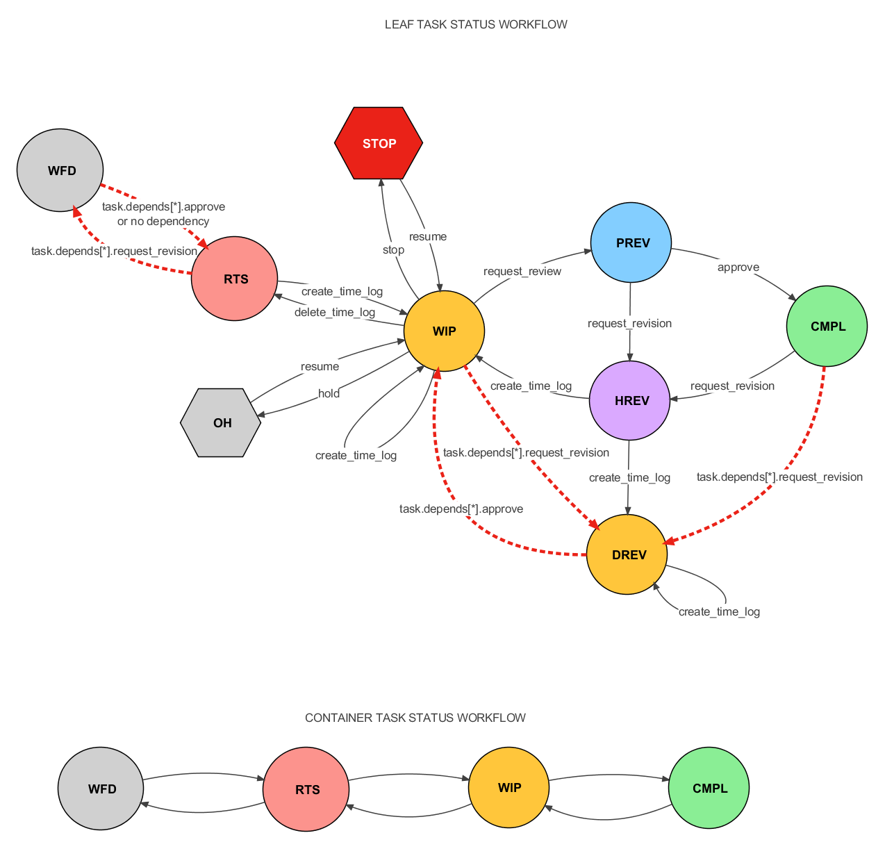

.. _task_review_workflow_toplevel:

====================
Task Review Workflow
====================

Introduction
============

All tasks in Stalker have a specific purpose and goal. :class:`.Task` resources
are responsible for completing these tasks, while task responsible ensure their
correct execution. The Task Review Workflow provides a mechanism for reviewing
tasks withing Stalker.

The Workflow
============

A task resource can request a review from the task's responsible at any stage
of task completion, including for supervisory purposes.

When a review request is made, Stalker creates a :class:`.Review` instance
associated with the :class:`.Task`. This :class:`.Review` instance tracks the
review's status (initially set to `NEW`), any requested revisions (including
description, additional time allowances, and desired task statuses).

Single Responsible and Resource Scenario
========================================

Consider a task with a single responsible and a single resource. When the
resource requests a review, Stalker creates a :class:`.Review` instance
assigned to the responsible. The responsible then review the task and can:

- **Approve**: If the task is complete, the responsible can approve the review
  by calling the :meth:`.Review.approve()` method.

- **Request Revision**: If additional work is required, the responsible can
  request a revision by calling the :meth:`.Review.request_revision()` method.
  This involves specifying the necessary revisions, additional time.

Multiple Responsible Scenario
=============================

If multiple responsible are assigned to a task, a Review instance is created
for each of them when a review is requested. The task is considered incomplete
until all responsible have approved the review. If multiple responsible request
revisions, the total revision time is added to the task, and the resource
continues working.

Dependent Tasks
===============

When a revision is requested for a completed task with dependent tasks, different
scenarios arise:

**Scenario A: Dependent Tasks Are All in Ready-To-Start (RTS) Status*

If there are no dependent tasks or none have started (all in `RTS`), the
dependent tasks are set to `Waiting For Dependency (WFD)` to prevent work until
the original task is completed.

**Scenario B: Started or Completed Dependent Tasks**

If there are dependent tasks and some have started or completed,
their status is updated based on the following table:

  +----------------+--------------+
  | Initial Status | Final Status |
  +----------------+--------------+
  | WFD            | WFD          |
  +----------------+--------------+
  | RTS            | WFD          |
  +----------------+--------------+
  | WIP            | DREV         |
  +----------------+--------------+
  | PREV           | PREV         |
  +----------------+--------------+
  | HREV           | DREV         |
  +----------------+--------------+
  | DREV           | DREV         |
  +----------------+--------------+
  | OH             | OH           |
  +----------------+--------------+
  | STOP           | STOP         |
  +----------------+--------------+
  | CMPL           | DREV         |
  +----------------+--------------+ 

Once the revised tasks is approved and set back to `CMPL`, dependent tasks are
restored to their original statuses based on their time logs:

  +-----------------+------+------+-----+----+------+
  |                 | DREV | PREV | WFD | OH | STOP |
  +-----------------+------+------+-----+----+------+
  | Has No TimeLogs | RTS  | PREV | RTS | OH | STOP |
  +-----------------+------+------+-----+----+------+
  | Has TimeLogs    | WIP  | PREV | WIP | OH | STOP |
  +-----------------+------+------+-----+----+------+

As you see the task statuses will be restored to their original statuses except
for HREV and CMPL. HREV tasks can not be restored, because even in a normal
situation where there are no revision requested for the dependent task,
creating a new time log will set its status to WIP, and a CMPL task can not be
stored to CMPL status because there were revisions to the depending task so
there should be some work to be done to update this task, so it is restored as
WIP.

The following workflow diagram illustrates the task status transitions, and it
is a good idea to familiarize yourself with the task statuses used in Stalker.

Revision Counter
================

Both :class:`.Task` and :class:`.Review` instances have ``review_number``
attribute. Reviews with the same ``review_number`` belong to the same review
set. Multiple :class:`.Review` instances with the same
:attr:`Review.review_number` can exist if they have different reviewers.

- The :attr:`.Task.review_number` starts at 0 for the initial revision and
  increments with each review requests. So a :class:`.Task` with
  ``review_number`` is 0 has no reviews yet.

- A newly created :class:`.Review` instance has a ``review_number`` one higher
than the :attr:`.Task.review_number` at the time of creation.

To create revisions effectively, use the :meth:`.Task.request_review()` method.
This ensures correct :class:`.Review` instance creation per reviewer and
correct ``review_number`` assignment and will return the newly created
:class:`.Review` instances as a list. Each responsible should use the
:meth:`.Review.approve()` or :meth:`.Review.request_revision()` methods to set
the appropriate status and additional revision information.
